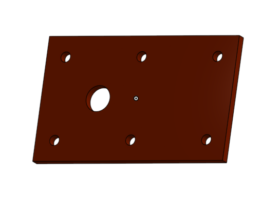
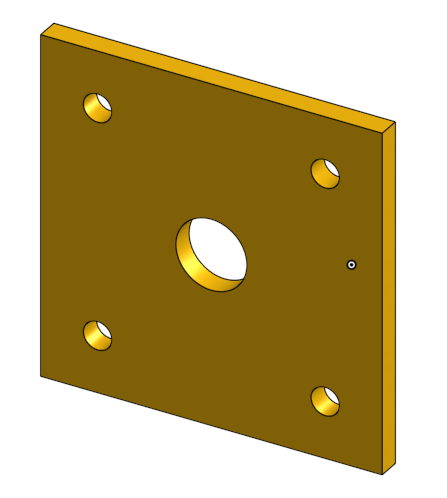
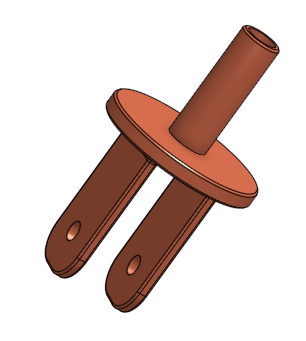
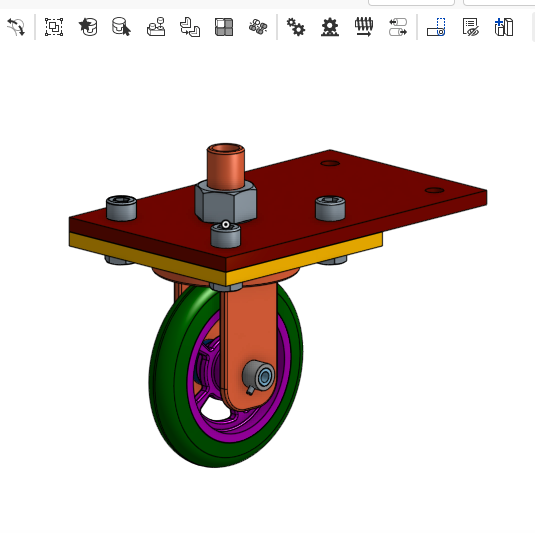
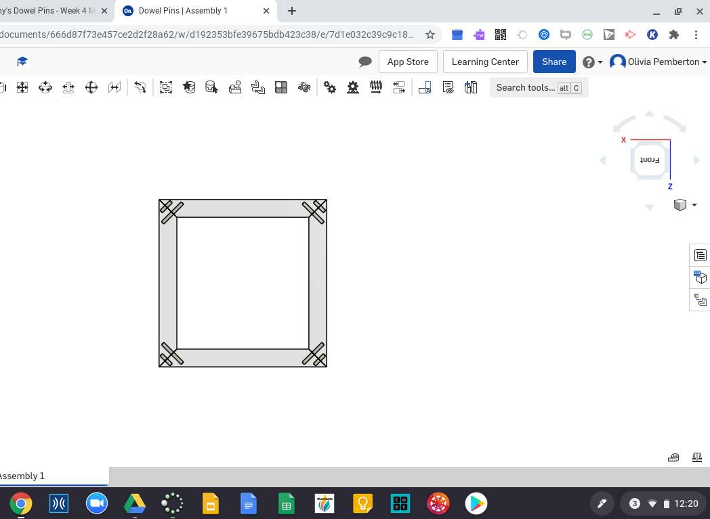

# OnShape
## Caster
### Base

#### Reflection
### Mount

#### Reflection
### Fork

#### Reflection
### Tire
#### Reflection
### Wheel
#### Reflection
### Axel, Collar, Bearings
#### Reflection
### Sub Assembly
#### Reflection
### Final Caster Assembly

#### Reflection
In this assignment I had to make a base, mount, fork, tire, wheel, axel, collar, and bearings then assemble them. This assignment taught me all the basic skills I needed to know to use OnShape, I think Onshape is easier and faster to use than Solidworks but the mates are slightly more confusing.
## OnShape Challenge

#### Reflection
In this assignment I got to use the OnShape skills I had just learned to create a cube that spins between two spinner shafts. I thought the hardest part of this assignment was using the right type of mates and using them in the correct place. I also had toruble creating the bracket since it was not a normal shape.
## Dorothy's Dowel Pins

#### Reflection
In this assingment I created dowel pins so that I could put a picture frame together. It taught me how to use configurations on OnShape, instead of making 16 different dowel pins I used configurations to make four differnt heights an four differnt diameters. We also used onfgurations to make dowel pins with and without a chamfer at the end. I thought the OnShape configurations were easier to use than Solidworks configurations.
